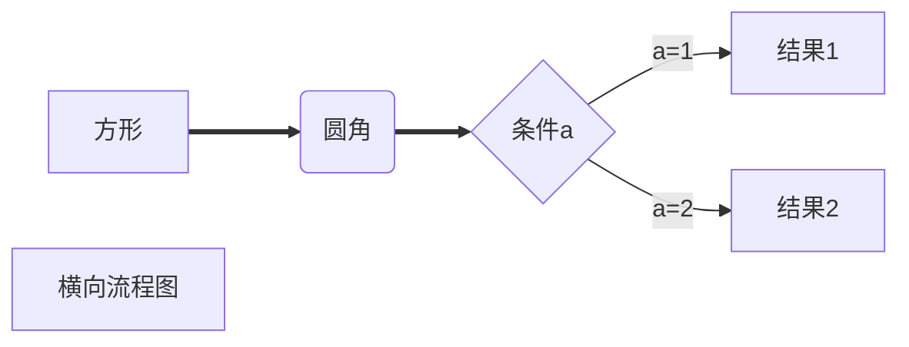
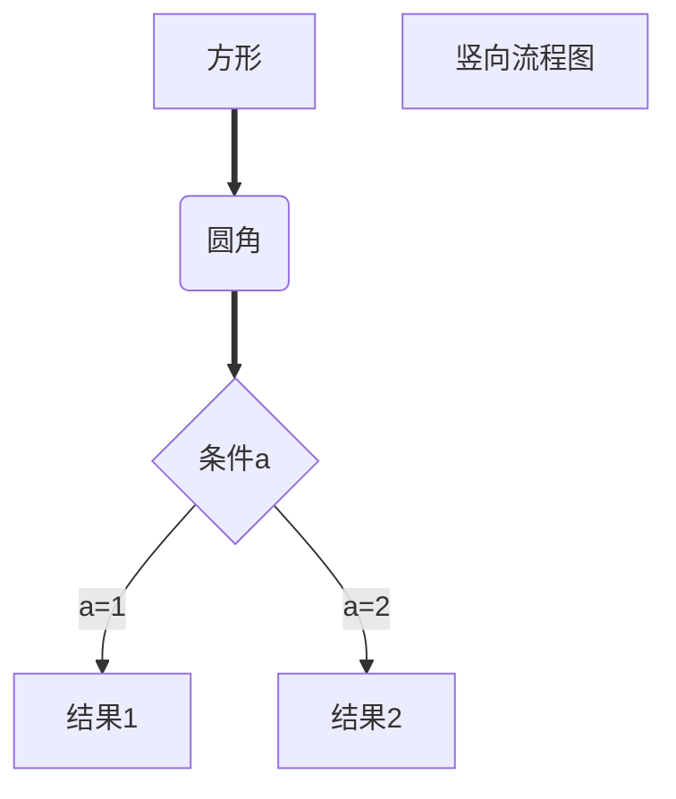
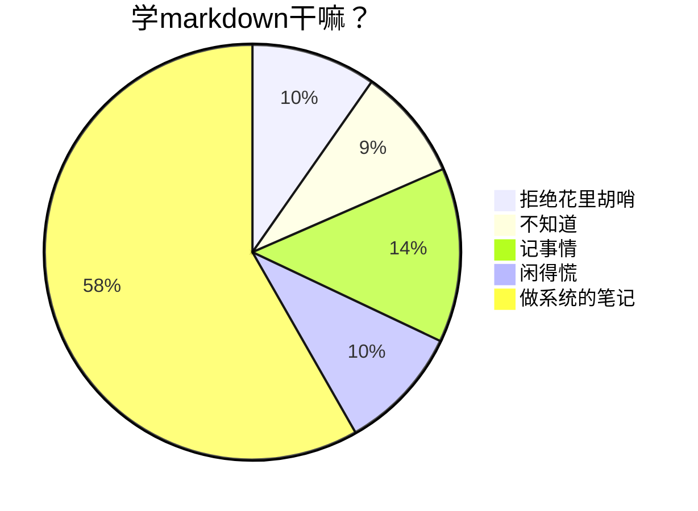
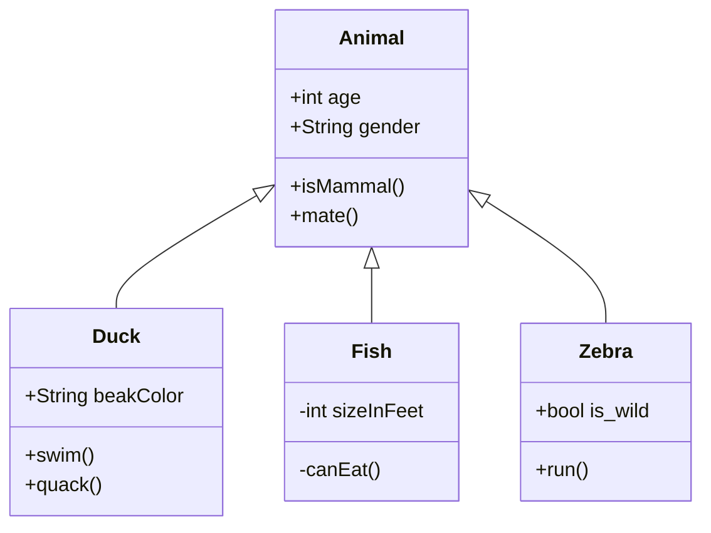

---
{"dg-publish":true,"permalink":"/Markdown/markdown语法/"}
---

[[CodeGarden\|Home]]
<font color=red><small>*使用markdown的目的就是追求==简洁==，请勿因花哨而南辕北辙*</small></font>
# 一、标题
标题使用 # ，与标题之间需要隔着一个空格，总共有1-6级，1级最大

代码：
~~~text
###### 这是一个 6 级标题，
##### 这是一个 5 级标题
#### 这是一个 4 级标题
### 这是一个 3 级标题
## 这是一个 2 级标题
# 这是一个 1 级标题
~~~
---

# 二、段落
### 1、分割线
分割线 \-\-\- 加 回车 或者 \*\*\* 加 回车，有时候 \-\-\- 会将上一行的文版有影响，所以使用 \*\*\*
代码：
~~~text
---回车
~~~
***
### 2、换行
回车换行是不显示的
代码：
~~~text
<br>
或者输入一个大于号
>
~~~
效果：
<br>
>
***

# 三、文字显示
### 1、字体
代码：
```text
**加粗**
~~删除线~~
<u>下划线</u>
*斜体*
***粗斜体***
==高亮==
```
效果：
**加粗** ，       一对双星号 `Ctrl/Cmd` B
~~删除线~~ ，   一对双飘号 
<u>下划线</u> ，   一对u标签
*斜体*  ，     一对单星号 `Ctrl/Cmd` I
***粗斜体***  ，一对三星号
==高亮==  ，     一对双等号
### 2、上下标
代码：
~~~text
X<sup>2</sup>
$X^2$
H<sub>2</sub>O
~~~
效果：
X<sup>2</sup>
$X^2$
H<sub>2</sub>O
### 3、颜色
代码：
```text
<font color="red">这段变红色</font>
```
效果：
<font color="red">这段变红色</font>
### 4、分数
代码：
~~~text
$\dfrac{a}{b}$
$\frac{a}{b}$
${a\over b}$
~~~
效果：
$\dfrac{a}{b}$
$\frac{a}{b}$
${a\over b}$

### 5、开方
代码：
~~~text
$\sqrt[根指数,省略时为2]{被开方数}$
~~~
$\sqrt[根指数,省略时为2]{被开方数}$

***

# 四、列表
### 1、无序列表
代码：
~~~text
- 加空格 加文本内容
* 加空格 加文本内容
+ 加空格 加文本内容
上面的效果都是一样的
eg：* 这是一个无序列表
~~~
效果：
- 这就是一个无序列表
- 这也是一个无序列表

子集的形式，需要 ==shift== 加 ==回车== 去换行，然后选择列表
对列表的调整也可以用ctrl + ] （tab是用不了的
* 文本记录
  * 富文本
  * MarkDown
    * Typora
    * Obsidian

### 2、有序列表
代码：
~~~text
数字加 . 加空格
eg：1. 这是一个有有序列表
~~~

效果：
1. 这是一个有序列表
2. 这是一个有序列表
3. 这是一个有序列表

### 3、任务列表
代码：
~~~text
- 空格 [空格] 空格 任务
- [ ] 任务1
- [x] 任务2 小写的 x
~~~

效果：
- [ ] 任务1
- [x] 任务2
***

# 五、区块显示
代码：
~~~text
>内容回车
~~~
效果：
>这是一个外层区块
>>这是一个内层区块
>>>这是一个内层区块

***
# 六、代码显示
### 1、行内代码
代码：
~~~text
`#include <iostream>`
~~~
效果：
`#include<iostream>`

### 2、代码块
代码：
\~\~\~ 加上 编程语言或者text、html、mermaid 这类的
以\~\~\~ 结尾<br>
\~\~\~ text
这里写代码或者文本
\~\~\~<br>
\`\`\` 也可以<br>
\`\`\` text
这里写代码或者文本
\`\`\`<br>

效果：
~~~C++
#include <iostream>
using namespace std;
int main() {
	cout << "hello world" << endl;
	return 0;
}
~~~

***
# 七、链接
代码：
```text
https://www.baidu.com
[百度一下](https://www.baidu.com)
[百度一下](https://www.baidu.com "百度首页") 这个会有预览信息
快捷键：ctrl+k
```

效果：
https://www.baidu.com
[百度一下](https://www.baidu.com)
[百度一下](https://www.baidu.com "百度首页")
***
# 八、脚注
代码：
```text
[^文本]
[^文本]:解释说明
```

效果：
Markdown[^1]
***
# 九、图片插入
代码：
```text
，不同的markdown编辑器可能不同的
  
![[图片名|宽度数值x高度数值]]
![[图床]]
```
调整图片的大小
`` 
`![[image.png|100x100]]` 
如果要根据图像的宽高比例进行缩放，请省略高度，如 `![[image.png|100]]`。

# 十、表格
代码：
```text
| 表头1 |  表头2 |
|:-:|:-:|
|这是第一行文本<br>这是另起一行的文本|普通文本|
```
效果：
| 表头1 |  表头2 |
|:-:|:-:|
|这是第一行文本<br>这是另起一行的文本|普通文本|
***

# 十一、拓展文本标记
### 1、缩小文本
代码：
```text
<small>被缩小的文本</small> 
<small>*被缩小的斜体文本*</small>
<small>==被缩小的高亮文本==</small> 
<small><u>被缩小的下划线文本</u></small> 
<small>~~被缩小的删除文本~~</small> 
。。。
```
效果：
<small>被缩小的文本</small> 
<small>*被缩小的斜体文本*</small>
<small>==被缩小的高亮文本==</small> 
<small><u>被缩小的下划线文本</u></small> 
<small>~~被缩小的删除文本~~</small> 

### 2、多彩的文本
代码：
```text
<font color=red>红色文本</font>
```

效果：
<font color=red>红色文本</font>
***注意 多彩文本尽量慎用，*MarkDown* 的核心就是 *简洁精炼*，注重 *实质内容*，而非花哨的 颜色样式***

# 十二、嵌入媒体资源
### 1、嵌入音频
~~~text
<audio controls="controls" preload="none" src=""></audio>

![[文件.mp3\|文件.mp3]]
~~~
### 2、嵌入视频
```html
<video width="600" height="420" controls>
  <source src="movie.mp4" type="video/mp4">
  <source src="movie.ogg" type="video/ogg">
  <source src="movie.webm" type="video/webm">  
</video>

![[wenjian.mp4]]
```
### 3、嵌入网页
代码：
~~~
<iframe width=600 height=400 src="https://www.baidu.com" scrolling="auto" border="0" frameborder="no" framespacing="0" allowfullscreen="true"> </iframe>
~~~

# 十三、转义字符

代码：  
~~~text
\[\]
\`\`\`
~~~
效果：
\[\]
\`\`\``
# 十四、历程图

### 1、横向历程图
代码：
~~~text

~~~

效果：


### 2、竖向流程图
代码：
~~~text

~~~
效果：


### 3、饼图
~~~text

~~~


### 4、类图
代码：
~~~text

~~~
效果：


# 十四、Obsidian
>ps：Obsidian的双链使用方法 \[\[这里写md文件名\]\]
>\-\-\-
>aliases:
>/- 别的名字
>/- 这个名字
>
>\-\-\-
>用来起别名，找到潜在的链接

[Obsidian文档](https://publish.obsidian.md/help-zh/%E7%94%B1%E6%AD%A4%E5%BC%80%E5%A7%8B)
[[CodeGarden\|Home]]
## 注释
[^1]:这是一种文档的格式